About A1Circle:
A1Circle is an online support platform designed for people with diabetes to connect, share experiences, and access trusted information. The goal was to create an inclusive space that combines community discussion with structured health-related features, such as recipe tracking, medical Q&A, and emotional support.

## Updated work:

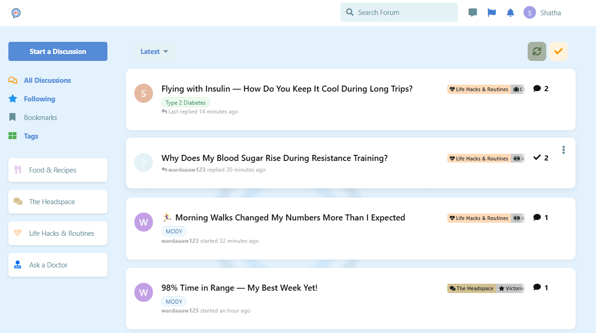
I structured the forum into four main categories:
Food & Recipes, where members share meals and must fill a structured recipe form (including carbs, protein, calories, and diabetes tips).
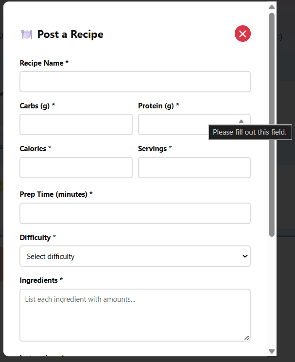
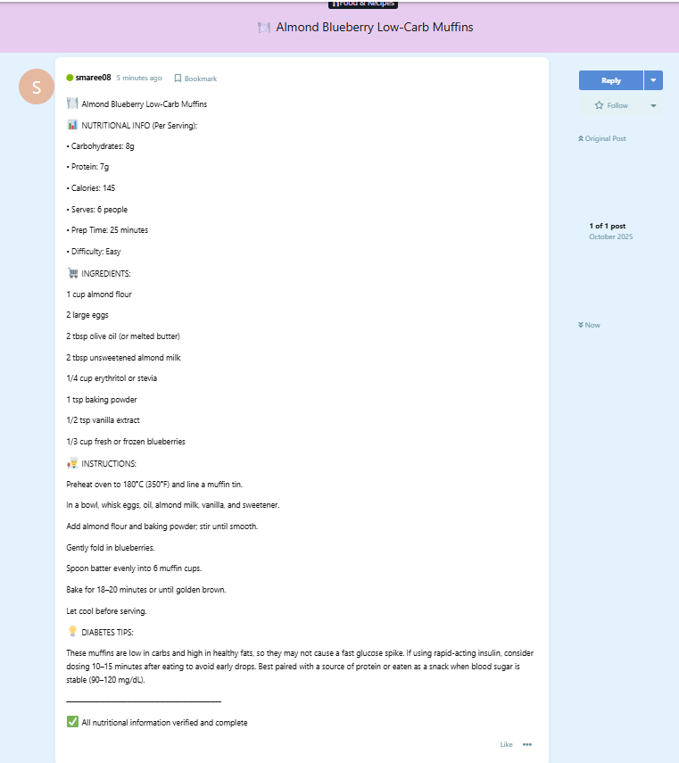

I added an “Ask a Doctor” category where users can post questions anonymously or with their name, and only site-verified doctors are allowed to answer. Doctors are clearly marked with special badges so members can quickly recognize trusted replies.
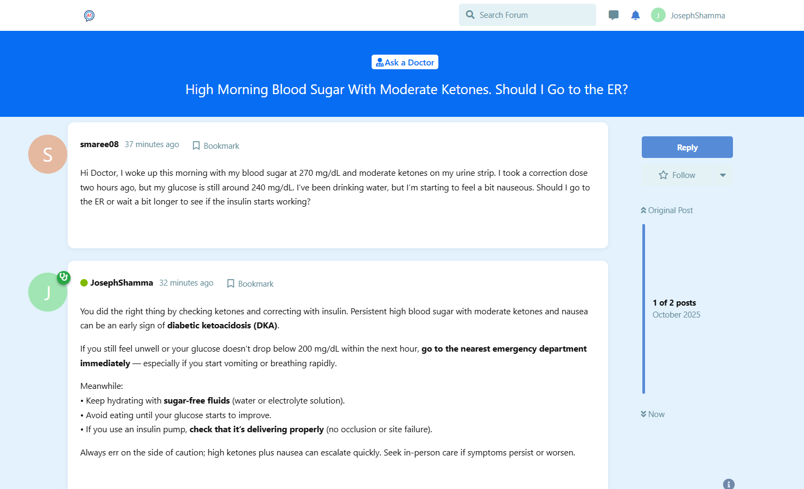

As well as The Headspace category, for emotional support and personal stories, and Life Hacks & Routines, for sharing practical everyday tips.
Each main category also includes relevant sub-categories to organize content better.
The My Story sub-category:
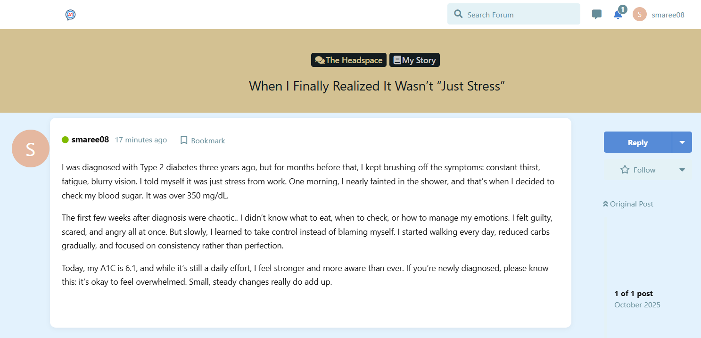
The victories & support sub-category:
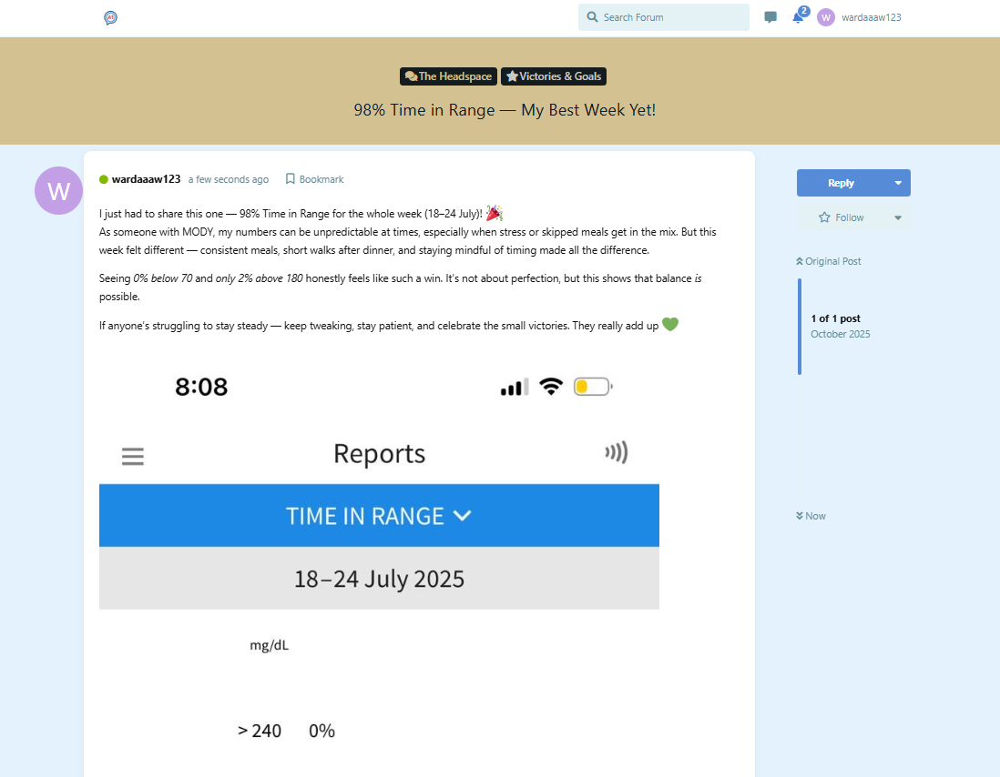
From Life Hacks & Routines sub-category:
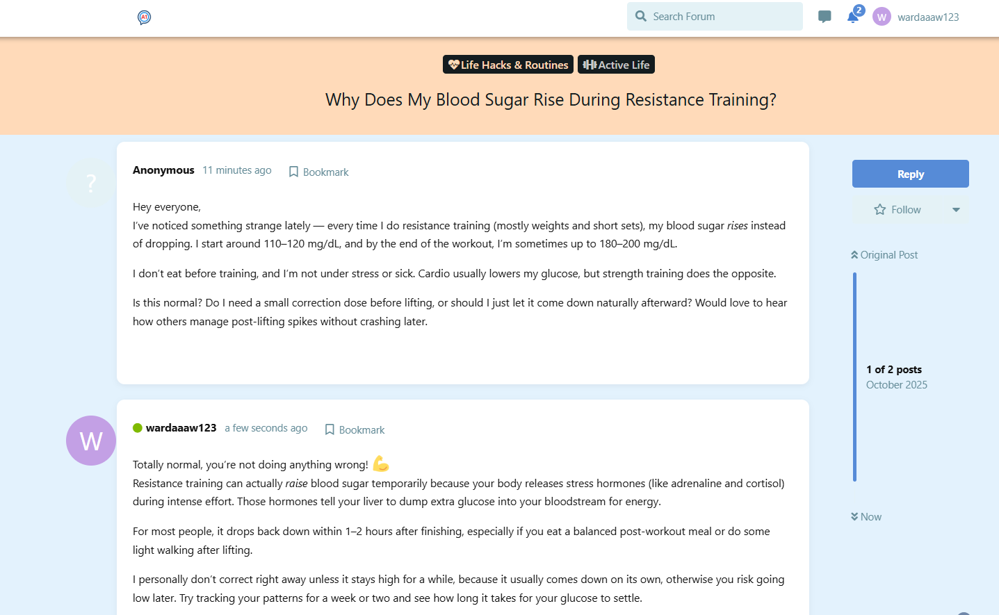
other examples in other sub-categories are shown in the website.

I also configured a professional email address (a1circle.connect@gmail.com) as the official sender for the platform.This address sends automatic verification emails to new users after signing up. Users cannot post or participate until their email is verified, ensuring authenticity and preventing spam accounts.
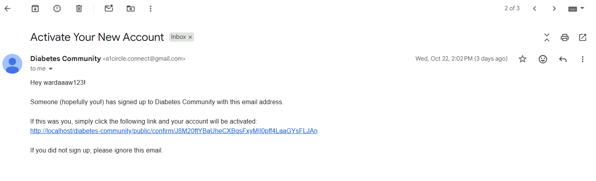

Users can follow a certain post and get notified by an E-mail when a new post is added to the discussion.
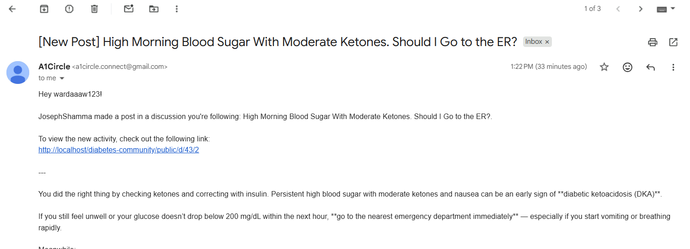

I've built a custom floating “Emergency” button in Flarum that opens a modal window displaying structured emergency and support information, as well as our "contact us" information, in addition to some important links regarding Hypo Treatment Guide, Sick Day Rules and DKA Checklist.
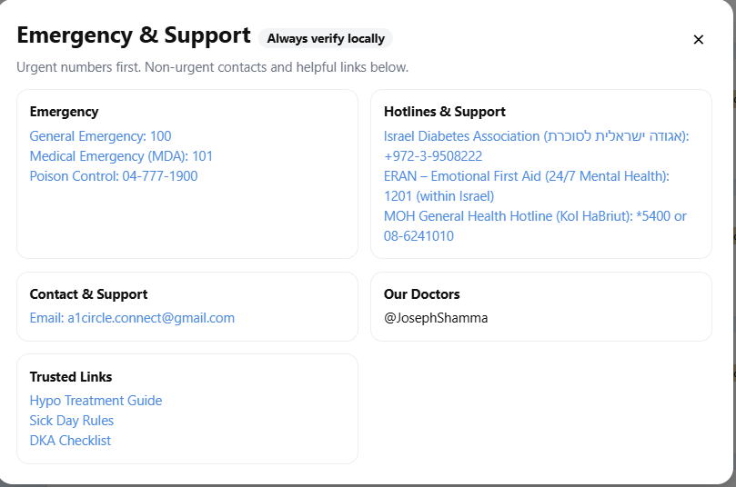

I enhanced the website’s logo, which now features the letters A1 inside a blue circle, symbolizing the platform’s name, A1Circle. The term A1C refers to the annual blood test that people with diabetes perform to monitor their long-term blood sugar levels, making the logo both meaningful and relevant to the community’s purpose.

I implemented a feature that fetches each user’s diabetes type from the database and displays it both on their forum posts and profile page. I achieved this by injecting a custom JavaScript function into the project’s footer, which retrieves the user’s diabetes type through the /api/users endpoint and dynamically appends it as a styled “Diabetes Type” tag beside each author and within their profile header.
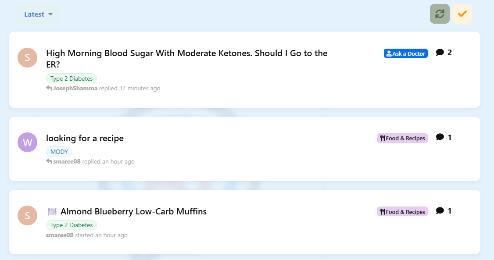
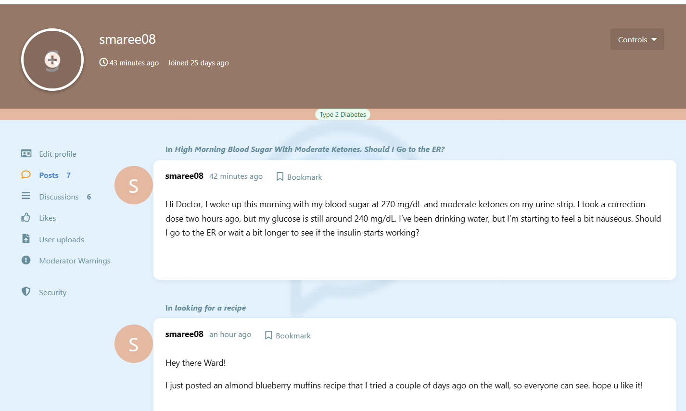

I wanted to add a filter system to the Food & Recipes category so users could easily view recipes based on their difficulty level (Easy, Medium, or Hard). I added a section that dynamically adds a dropdown filter to the Food & Recipes page. The script detects when a user is on the recipes tag and shows a filter menu. When a difficulty level is selected, it communicates with Flarum’s API to fetch only the posts containing that exact difficulty phrase (like “• Difficulty: Medium”) and hides all others from the visible list.
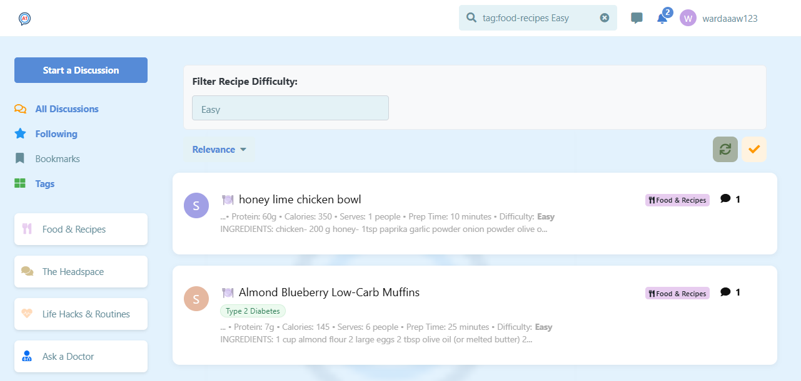

I added reactions extension, as well as private messaging, where users have the ability to DM one another freely.
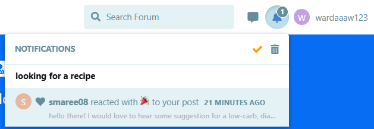
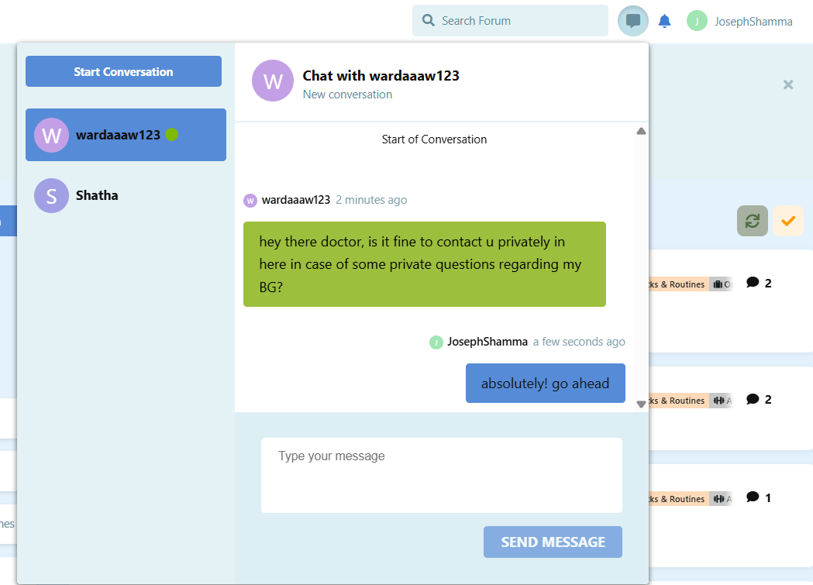
Users get notified by an E-mail when they recieve a private message:
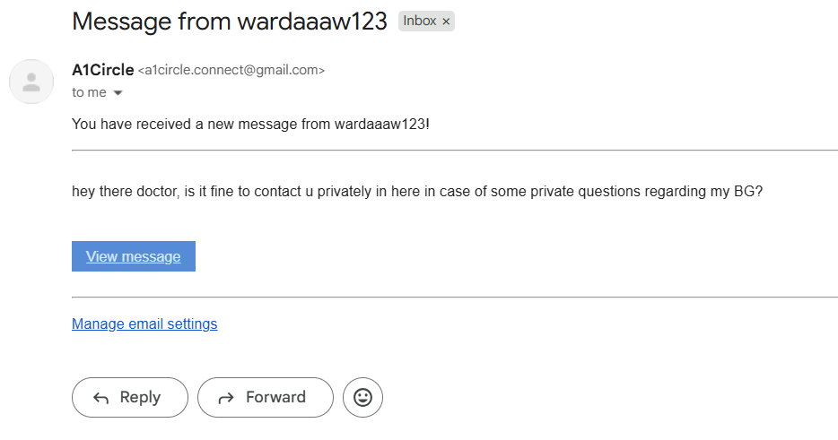

## Problems faced and solutions:

1. The background logo watermark suddenly disappeared from the forum interface:
   Initially, the logo would only appear after a manual page reload and then vanish again. This happened because Flarum dynamically redraws its frontend every time the user navigates between pages or triggers interface updates. These redraws were removing the static  logo element that was injected through the footer.
   To solve this, I implemented a function that periodically checks if the logo is missing and re-adds it automatically.

2. I faced issues with fetching user data correctly, regarding diabetes type, the API occasionally returned undefined results or failed to match user IDs and usernames. I resolved this by improving the fetching logic to support both lookup methods and by caching responses to avoid redundant calls.
   After debugging and refining the logic, the data loaded reliably and displayed accurately for every user across the site.

3. I faced a problem where selecting a difficulty level kept redirecting users to the main page instead of showing filtered recipes. This happened because Flarum’s built-in router didn’t work correctly with our local path. To fix it, I replaced the router-based logic with a client-side filter that directly fetches and displays matching recipes using the Flarum API—solving the redirect issue completely.

4. I faced two main issues in signing up new members. The first was that the Diabetes Type selected by users during sign-up wasn’t being saved to the database. Although the field appeared in the registration form, it wasn’t reaching the users table in phpMyAdmin. I solved this by adding a diabetes_type column to the table, updating the backend registration logic to handle the new field, and connecting it properly to the signup form using JavaScript and PHP event listeners.
   The second issue involved the email verification system, which caused an error when sending confirmation emails. This was fixed by properly connecting a Gmail account with an App Password and updating the email configuration in Flarum’s admin panel. After these fixes, new users could register successfully, their diabetes type was stored correctly, and the platform could send verification emails without issues.

-> User-Centered Design:
This platform was developed based on feedback and real needs shared by people with diabetes whom I personally know. Their daily experiences inspired many of the features — such as structured recipe entries with carb and protein data, verified doctor replies, and emotional support spaces. Each component was built to address practical challenges they face in managing diabetes, ensuring that A1Circle is not just functional, but truly meaningful for its users.
