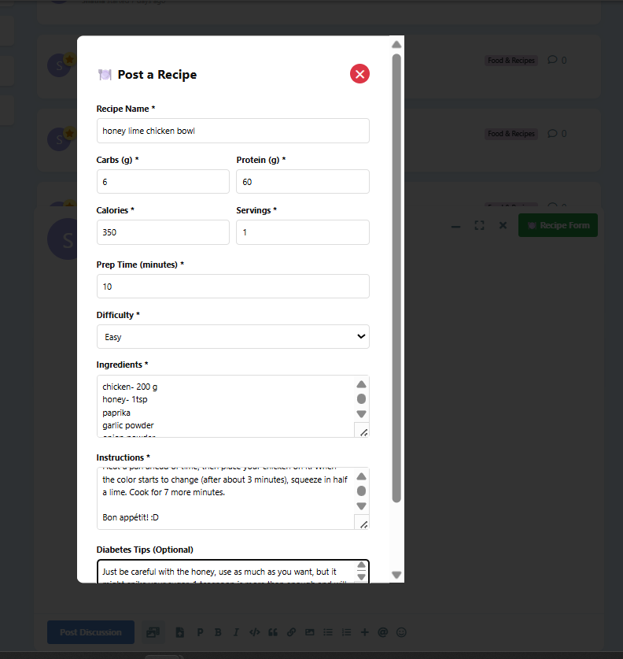
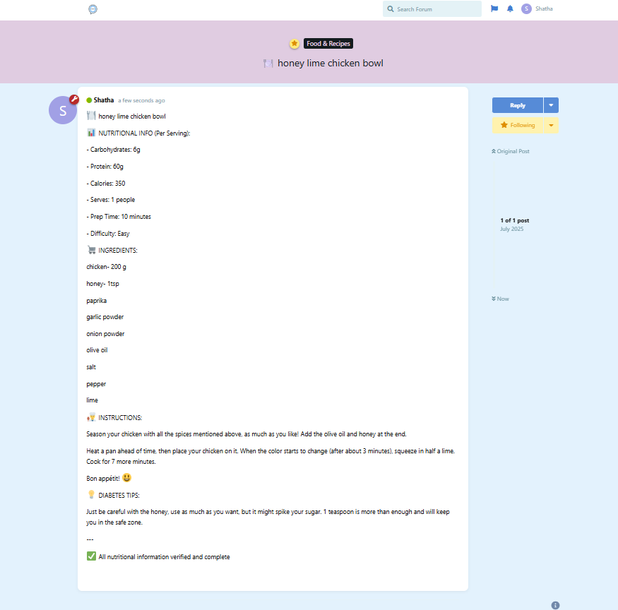

## what I have done so far:

I created a logo for the website using AI, where it consists of a blue circle (which is the symbol for diabetes) inside a message symbol, which reflects what this website is all about, a comforting and supportive platform for diabetics.

I have worked on the following categories so far, some more than others:

1. food and recipes:
   In this section, users can share recipes that are diabetes-friendly, as well as add all the important info regarding the recipe.  
   
   
   when fully filled, the form turns into a post, and the user can submit it like this:
   
   aterwards, it’s posted on the category's wall:  
   

2. I added a category/tag for newly diagnosed diabetics where they can clear their mind and share their first thoughts and questions as newly diagnosed.  
   

3. I also created a category for venting, something I would’ve personally used a lot as a diabetic.
   

4. This section is for asking about insulin injections, medications, sports and avoiding hypos/spikes, etc., where a specialized doctor or nurse can answer
   

## problems I have faced so far, and still working on:

When signing up, I added the option for selecting the diabetes type, it’s supposed to help with the website's stats, and also let users decide if they want their type to show publicly on the site. This can help others relate, especially in the medical questions section.

I did succeed in adding the field in the sign-up form, but I haven’t yet managed to save it to the DB.  

## what I still need to work on:

1. the option of posting anonymously in the medical questions category
2. the doctor/nurse's page
3. I’m thinking about adding a category for diabetes news/articles/research, but I still haven’t gotten to that part yet
4. I also need to improve the categories mentioned in bullet 2 and 3 in 'what I have done so far', I feel like they are too plain and I need to shake things up

P.S: I might add more categories and improvements later, but this is what I had in mind for now.
